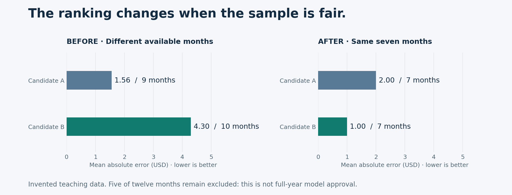

# Model Risk · From results to decisions

**Review forecasts. Find hidden differences. Explain what the evidence supports.**

A portfolio by **Zheyu Liu** · Independent projects using public methods and invented data

[Start the flagship case](flagship/forecast-review/README.md) · [Try table reconciliation](https://table-check-zheyuliu.mystic-pear-2111.chatgpt.site) · [中文学习路线](learning/README.zh-CN.md)

---

## A better score. A different sample. A different decision.

You receive two monthly forecasts. Candidate A reports a lower error, so it appears to be the better model. Before recommending it, you check which months were actually evaluated.

**A is missing the final quarter. B is missing two other months. The comparison was never like-for-like.**

The ranking reverses on the shared sample. Your recommendation also changes: **B performs better on these seven months; request the missing coverage and forecast-vintage evidence before recommending adoption.** This case uses invented revenue forecasts, not client data or a fitted credit model.

### What you can actually do

| Bring | Execute | Take away |
| --- | --- | --- |
| Actuals, candidate forecasts and an optional baseline in CSV/Excel | Map columns; check dates, definitions and missing coverage; explicitly accept a common sample; compare MAE/RMSE/bias | An offline report, row-level errors, excluded periods and input fingerprints |
| A conflicting declaration or incomplete forecast | Inspect why comparison is pending or blocked; retain the issue instead of filling gaps with zero | A visible exception and a specific request for further evidence |
| Your review judgment | Record a reason in the Workbench interface and export it with the source-bound results | A review handoff that separates calculation from human opinion |

**[Run the flagship →](flagship/forecast-review/README.md)** · [Read the worked review memo](flagship/forecast-review/REVIEW_MEMO.md) · [Open the Workbench locally](https://github.com/zheyuliu328/forecast-review-workbench#open-the-tool)

The Workbench is the application. Model Risk Lab supplies its version-pinned numerical foundation. This repository supplies the case narrative, reproduction inputs, independent metric check and learning routes.

---

## Pick the next work problem

### 01 · “The totals agree. Can I release the report?”

Two tables can contain +10 and −10 errors that cancel. **Financial Control Tower** maps fields and compares records, retaining missing keys, duplicates and numeric differences. The output is an exception report you can inspect and hand over. A record absent from both tables still requires an independent expected population.

[Try the browser tool](https://table-check-zheyuliu.mystic-pear-2111.chatgpt.site) · [Read the workflow](https://github.com/zheyuliu328/financial-control-tower/blob/main/docs/table-ui.zh-CN.md)

### 02 · “The prices agree. Why do the sensitivities disagree?”

A close option price does not establish correct risk units. **Model Risk Lab** compares European FX analytical sensitivities with finite differences across bump sizes. Inspect unit conventions, convergence and retained failures before accepting a sensitivity.

[Inspect the experiment report](https://github.com/zheyuliu328/model-risk-lab/blob/main/docs/sample/REPORT.md) · [Methods and limits](https://github.com/zheyuliu328/model-risk-lab)

### 03 · “Why did the loss estimate rise?”

The **ECL movement case** changes exposure, default window, parameters and scenario weights in a declared order. Run the bridge, reconcile opening to closing, and explain the contributions. The result is a teaching attribution, not automatic SICR assessment or a complete accounting engine.

[Run the worked case](scenarios/WORKED_CASES.zh-CN.md) · [Inspect the request](examples/ecl-movement.json)

### 04 · “Collateral covers the loan. Will cash arrive in time?”

The **margin stress case** separates haircut-adjusted collateral, required margin calls and realizable proceeds. Run a price/liquidity shock and identify the funding gap. A demand for collateral is not money received.

[Inspect the stress inputs](examples/broker-margin.json) · [Read the response plan](scenarios/WORKED_CASES.zh-CN.md)

[All specialist cases, including market risk and negative research →](specialist/README.md)

---

## Learn beyond the featured work

The [learning laboratory](lab/README.md) contains small executable exercises in credit, market, liquidity, ALM and governance controls. They support understanding and independent challenges; they are not sixteen equally mature products.

[Choose a role-based route](learning/README.zh-CN.md) · [Try an unfamiliar interview case](learning/CASE_INTERVIEWS.zh-CN.md) · [Download example reports](https://github.com/zheyuliu328/risk-practice-portfolio/releases/tag/v0.2.0)

<strong>Evidence, attribution and project map</strong>

- [Verification record](validation/README.md): reproducible calculations, independent checks and declared limits. Software checks do not establish production suitability or external adoption.
- [Project priorities](catalog/PRIORITIES.md): flagship, specialist, laboratory and reference placements.
- [Architecture](ARCHITECTURE.md): what is shared and what remains separate; no universal risk engine or automatic inter-project pipeline.
- [References and history](reference/README.md): team work, forks and supporting utilities with attribution.
- New examples use public methods and independently invented inputs. Professional/client files remain private. AI-assisted implementation and review are disclosed; learning cases are not claims of client experience or personal mastery.

